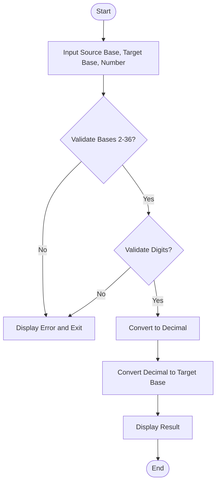

  
  
  
  

<h1 align="center">🔢 Number System Converter (C)</h1>

  A lightweight and efficient CLI tool written in C language that converts numbers between different bases (2–36).  
  Designed for students and developers learning system-level programming and base arithmetic.

---

## 📖 Overview

This project demonstrates **number system conversion** using core C programming principles — no external libraries, just clean logic, efficient computation, and precise error handling.

The Number System Converter is a simple yet robust command-line tool written in C, built to perform conversions between any two bases ranging from 2 to 36.

This project was designed to demonstrate how core computer systems represent and manipulate numeric data at the binary level — giving you an inside look at how base conversion works without relying on built-in libraries.

At its heart, this program:

Parses a user-provided number in a given source base

Validates its correctness based on the base’s valid digits

Converts it into an intermediate decimal form

Then re-encodes it into the target base

All of this is done using efficient C logic and minimal memory footprint — making it lightweight, portable, and easy to understand for beginners and enthusiasts exploring low-level data representation, string parsing, and integer arithmetic.

---

**The tool is ideal for:**

📘 Students learning number systems, binary/hex arithmetic, or C fundamentals

💻 Developers working on compiler or systems-level utilities

⚙️ Educators demonstrating numeric conversion logic in lectures or labs

---

### ⚙️ Flowchart Overview
Below is the logical flow of the Number System Conversion process:

